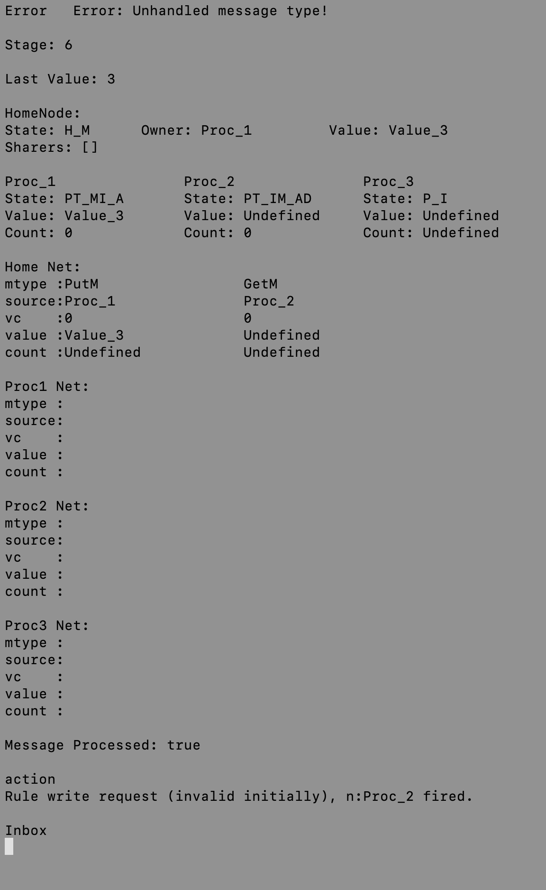

# PA2

### How to run the program

1. copy the shell and python scripts to your working directory
2. Rename your .m source file as cc.m
3. ```bash script```
4. ```python sim.py```

### How to control the program

- type n to go to next cycle

- type b to go back to previous cycle

- type e to exit

### If you are running on CAEN or BAEN

Use sim2.py instead

you have to press "enter" after each command

### An screenshot of the trace simulation program

